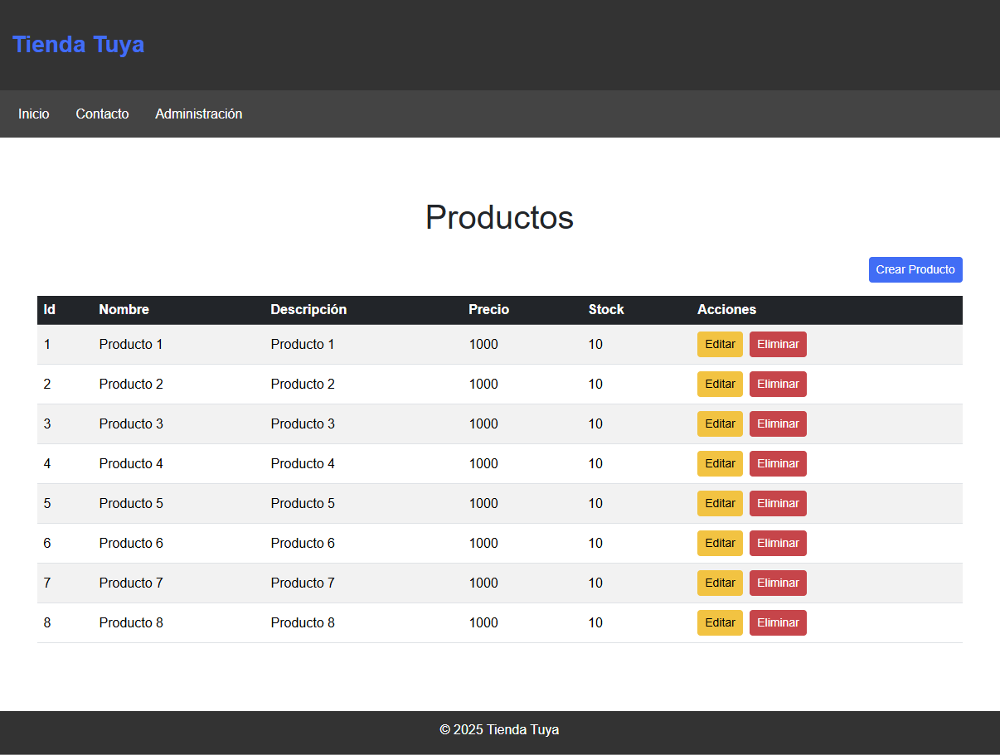

# Trabajo Práctico Final Programación Web Dinámica
Se implementará una aplicación de carrito de compras.

## Sistema desarrollado
Se implemento una aplicación web con un framework MVC desarrollado especificamente para esta tarea.

### Framework MVC
El framework desarrollado se puede ver en la carpeta framework y consta de los siguientes namespaces:
- Assets: maneja la generación y envío de los assets proporcionados a la aplicación pública.
- Concers: proporciona algunos traits usados en otras clases.
- Configuration: provee clases para la configuración inicial de la aplicación.
- Core: provee la clase principal de la aplicación.
- Data: maneja el acceso a los datos.
- Http: maneja lo referido a las rutas que permitan redirigir a los controladores.
- Mail: provee una funcionalidad básica de envío de correos usando PHPMailer.
- Security: maneja la autenticación y el usuario de sesión.
- View: provee el manejo y compilación de vistas.

## Requisitos
- Composer
- Mysql 8
- PHP 8.4.7

## Inicio del sistema
Ejecutar el comando
```powershell
composer serve
```

## Imagenes
### Base de datos


### Home Cliente


### Mis Compras


### Detalle de Mis Compras


### Carrito de Compras


### Home Admin


### Home Admin Menu


### Home Administración


### Home Ventas


### Edición de Ventas


### Menu Home


### Crear Menu


### Editar Menu


### Home Productos


### Crear Producto


### Editar Producto


### Role


### Crear Rol


### Editar Rol


### Usuarios Home


### Crear Usuario


### Editar Usuario

